# How bidsval works

This is the complete technical reference for bidsval: what it is, how it is built,
why it depends on what it depends on, and exactly how a validation run works, layer
by layer. It is written for contributors and for anyone who wants to understand or
extend the engine. For day-to-day use see [usage](usage.md) and the
[CLI reference](cli-reference.md).

It avoids unexplained jargon: technical terms are defined where they first appear,
and all of them are collected in the [Glossary](#17-glossary) at the end. If a word
is unfamiliar, that section defines it in one line.

The diagrams use [Mermaid](https://mermaid.js.org), which renders as pictures
directly on GitHub.

## Contents

1. [What bidsval is](#1-what-bidsval-is)
2. [The one idea: the schema is the engine](#2-the-one-idea-the-schema-is-the-engine)
3. [The end-to-end pipeline](#3-the-end-to-end-pipeline)
4. [The layered structure and the modules](#4-the-layered-structure-and-the-modules)
5. [Dependencies, and why they are what they are](#5-dependencies-and-why-they-are-what-they-are)
6. [Design invariants](#6-design-invariants)
7. [Layer 1: resolving a schema](#7-layer-1-resolving-a-schema)
8. [Layer 2: indexing the files](#8-layer-2-indexing-the-files)
9. [Layer 3: building a per-file context](#9-layer-3-building-a-per-file-context)
10. [Layer 4: evaluating expressions](#10-layer-4-evaluating-expressions)
11. [Layer 5: the rule engine](#11-layer-5-the-rule-engine)
12. [Layer 6: results and rendering](#12-layer-6-results-and-rendering)
13. [The no-false-positives invariant](#13-the-no-false-positives-invariant)
14. [Performance and safe degradation](#14-performance-and-safe-degradation)
15. [Version independence and extension points](#15-version-independence-and-extension-points)
16. [Issue-code catalogue](#16-issue-code-catalogue)
17. [Glossary](#17-glossary)

---

## 1. What bidsval is

bidsval is a **BIDS validator**: a tool that checks whether a dataset follows the
[BIDS](https://bids.neuroimaging.io) standard (Brain Imaging Data Structure, a
convention for naming and organising neuroimaging files) and reports every place it
does not, in a way that explains how to fix it. A *validator* does not change your
data; it inspects it and produces findings (errors and warnings).

As a piece of software, bidsval is a pure-Python library and command-line tool. It
works by reading the official **BIDS schema** (a set of machine-readable files,
published by the BIDS project, that describe every BIDS term and rule) and applying
those rules to your files.

It is the lightweight, in-process alternative to the reference `bids-validator`,
which is a roughly 135 MB compiled program (built with the Deno runtime) that you
run as a separate process. Because bidsval is pure Python it runs inside your own
Python program, returns typed results you can use directly, and can validate a whole
dataset, one subject, one file, or even a single rule expression.

Every finding it reports aims to be **actionable**: as well as saying what is wrong
and where, it explains what the missing or incorrect file, field, or column should
contain, with a concrete example (see [section 12](#12-layer-6-results-and-rendering)).

---

## 2. The one idea: the schema is the engine

The BIDS schema is not just a list of allowed names. It also contains the
validation *logic*, written in a small **expression language** (a tiny mini-language
of conditions, described in [section 10](#10-layer-4-evaluating-expressions)). Three
kinds of thing live in the schema:

- **Selectors** decide *when* a rule applies. Example: `suffix == "T1w"` (a
  *selector* is a yes/no condition; *suffix* is the last label in a BIDS filename,
  like `T1w` in `sub-01_T1w.nii.gz`).
- **Checks** are conditions that must hold once a rule applies. Example:
  `nifti_header.dim[0] == 3` (a *check* is the actual requirement).
- **Vocabulary** lists every datatype, entity, suffix, file extension, metadata
  field, and table column, together with the value pattern or type each must
  satisfy. (A *datatype* is the folder that groups a kind of data, such as `anat` or
  `func`; an *entity* is a `key-label` pair in a filename, such as `sub-01` or
  `task-rest`.)

bidsval **interprets** that schema. It does not hardcode BIDS vocabulary, and it
does not hardcode BIDS rules: the datatypes, entities, suffixes, extensions, fields,
and the rules that use them are all read from the schema while the program runs.
Point bidsval at a different or newer schema and its behaviour changes with no code
change. The only thing bidsval contributes is the machinery to read the schema,
build a set of facts about each file, evaluate the schema's conditions against those
facts, and turn the outcomes into typed findings.

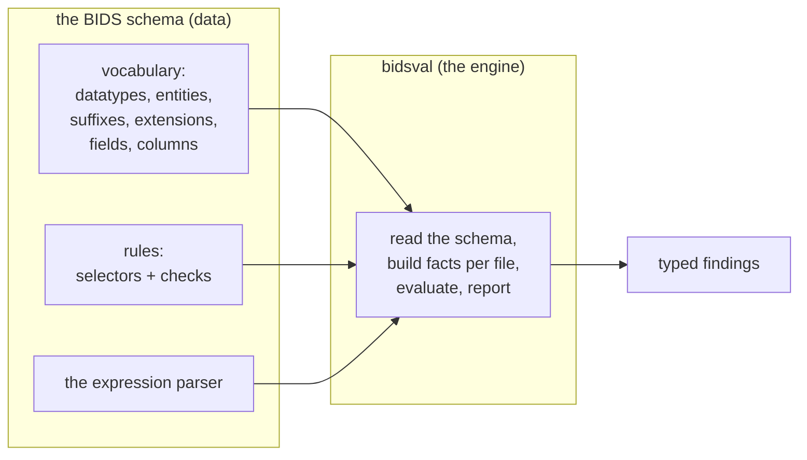

### What is, and is not, read from the schema

The claim above is about *BIDS vocabulary and rules*, which genuinely never appear
as fixed text (literals) in the code. It is not a claim that the code contains no
text at all: a small, deliberate set of structural constants and two checks that the
schema does not describe are written into bidsval. They are listed here so the
boundary is explicit.

| Read from the schema (no literals in the code) | Written into bidsval (the deliberate exceptions) |
|---|---|
| datatypes, entities (and their value patterns), suffixes, extensions | the three reserved top-level folders `sourcedata` / `code` / `derivatives` (in `files/tree.py`) |
| metadata field names, types, allowed values, numeric bounds | the map from requirement level to severity (`required` to error, `recommended` to warning, ...) |
| which fields are required or recommended per datatype and suffix | the short list of not-yet-built content headers (`gzip`, `ome`, `tiff`) the engine skips |
| the conditions (selectors + checks) for every rule | the two non-schema file checks (`EMPTY_FILE`, `NIFTI_HEADER_UNREADABLE`) |
| which folder extensions are whole-recording directories (those ending in `/`) | the built-in functions of the expression language (`match`, `exists`, ...): these are features of the *language*, not BIDS terms |
| associations (which file travels with which) | |

So the precise statement is: **bidsval hardcodes no BIDS vocabulary and no BIDS
rules; those come from the schema. The exceptions above are structural plumbing plus
two checks the schema itself does not express.** Supporting a new BIDS release is
normally a matter of bundling a new schema file, not editing code (see
[section 15](#15-version-independence-and-extension-points)).

---

## 3. The end-to-end pipeline

A full run (`bidsval.validate(root)`) is a straight line of steps: resolve a schema,
index the files, then for each file gather its facts (its *context*) and apply the
rules, collecting everything into one report. A *context*, used throughout this
document, is simply a dictionary of facts about one file that the rules are checked
against.

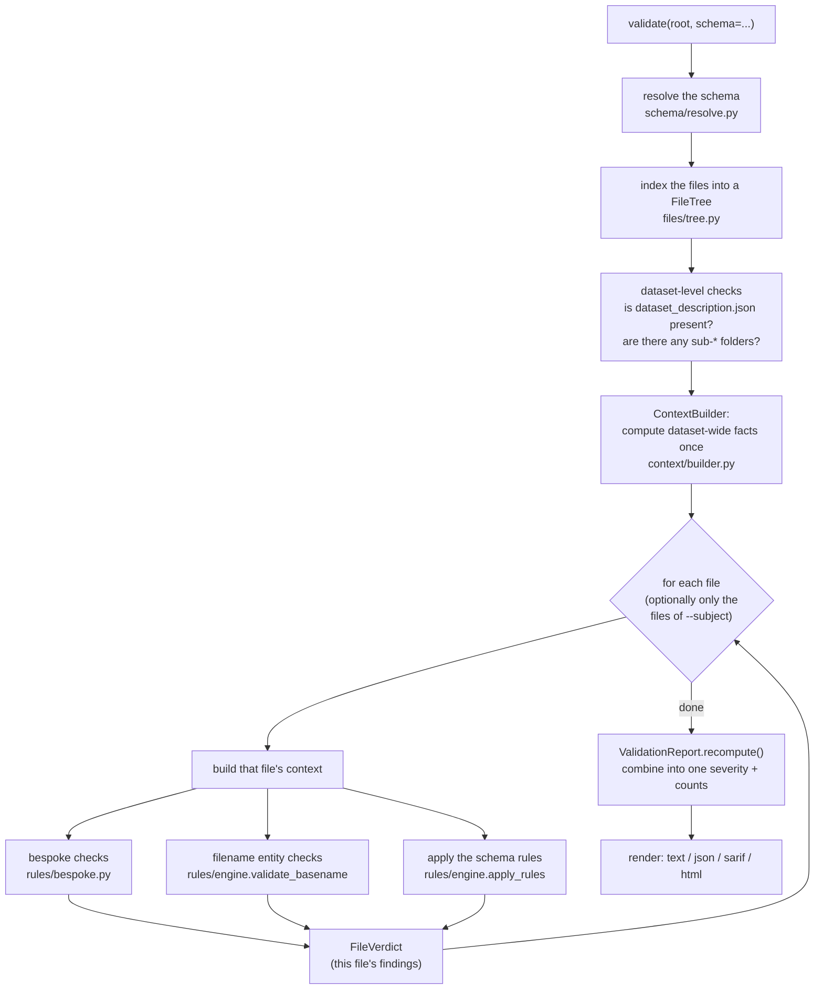

Key properties of the orchestration (the top-level control code in
[`validate.py`](../src/bidsval/validate.py)):

- **One schema, one file index, one set of dataset-wide facts per run.** The schema
  is resolved once, the files are indexed once, and the dataset-level facts
  (the list of subjects, the contents of `dataset_description.json`, which datatypes
  and modalities are present) are computed once and shared by every file.
- **One bad file cannot sink the run.** Each file is validated inside a
  `try`/`except` block (Python's way of catching errors); any unexpected error
  becomes a single warning on that file (`bidsval.internal_error`) instead of
  stopping everything.
- **Three granularities, one core.** `validate` (the whole dataset),
  `validate_subject` (only one subject's files), and `validate_file` (one file, with
  the rest of the dataset still indexed so cross-file checks work) all funnel through
  the same per-file routine.

The per-file routine as a step-by-step sequence:

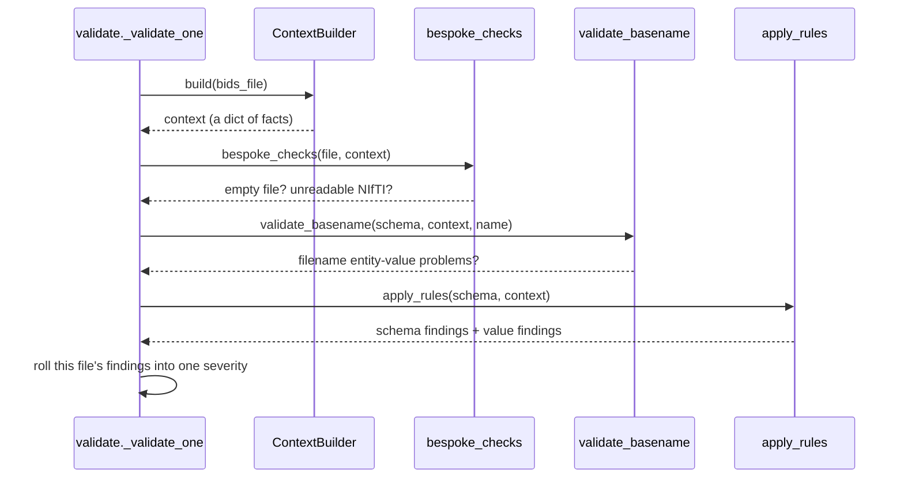

---

## 4. The layered structure and the modules

bidsval is six layers, each building on the one before. The dependencies point one
way, and the schema layer is the foundation that everything else reads from but that
reads from nothing else in the package.

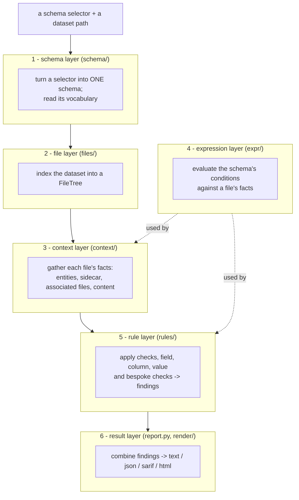

The same one-way rule, drawn as which module imports which. The schema layer is the
*keystone* (the central piece every other part rests on):

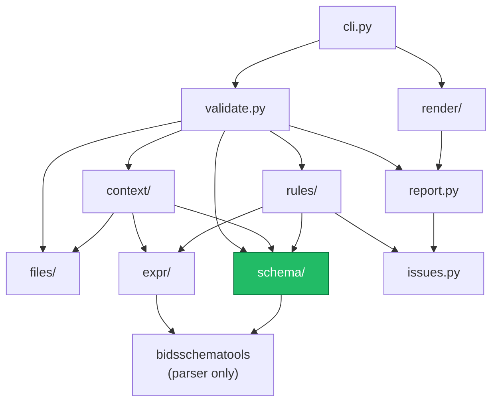

| Module | Responsibility |
|---|---|
| `schema/` | Turn a selector into one schema (`resolve.py`); download and cache remote schemas (`cache.py`); read BIDS vocabulary out of a schema (`introspect.py`). The only code that is aware of the BIDS version. |
| `files/` | Index the dataset into a `FileTree`. It is *lazy* (it records paths but does not read file contents until something asks). |
| `context/` | Gather each file's facts: its entities, its merged sidecar (defined in [section 9](#9-layer-3-building-a-per-file-context)), its associated files, and any loaded content. |
| `expr/` | Evaluate the schema's expression language (`evaluator.py`) and its built-in functions (`functions.py`). |
| `rules/` | Apply the schema's checks and field rules (`engine.py`), validate the value of present fields (`values.py`), validate table columns (`tables.py`), and run the two non-schema file checks (`bespoke.py`). |
| `validate.py` | The control code: `validate` / `validate_subject` / `validate_file`. |
| `issues.py`, `report.py` | The typed result types (`Issue`, `FileVerdict`, `ValidationReport`). |
| `render/` | Turn a report into text / JSON / SARIF / HTML. |
| `cli.py` | The `bidsval` command. |

---

## 5. Dependencies, and why they are what they are

bidsval exists to be the lightweight alternative to a 135 MB binary, so the
dependency list is kept short and every entry earns its place. They install
automatically with bidsval; there is one development-only extra.

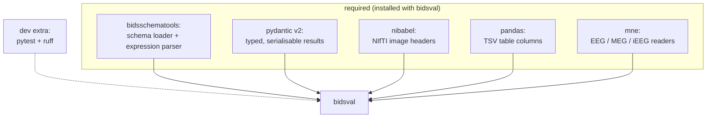

### bidsschematools (the schema and its parser)

This package provides the official BIDS schema and the *parser* for its expression
language (a *parser* is the code that reads condition text and turns it into a
structured form a program can evaluate). It is the single source of BIDS knowledge.

bidsval **bundles** a self-contained copy of the schema for each supported version:
a *dereferenced* `schema.json` (meaning every internal cross-reference inside the
schema has been expanded inline, so the file stands alone). Bundling means the
default schema works offline and is pinned to a known BIDS version no matter which
`bidsschematools` happens to be installed. bidsval uses the package only to load a
schema into memory and to parse expressions; it copies no BIDS terms into its own
code.

### pydantic (version 2)

Every result bidsval returns (`Issue`, `FileVerdict`, `ValidationReport`,
`RuleProvenance`, `Fix`) is a *pydantic model*: a typed data class that checks its
own fields and converts to and from JSON automatically. This is a deliberate choice
that the design leans on, not a convenience:

- **Typed, self-checking results.** The shape of a result is enforced, so a program
  that consumes bidsval gets real, predictable types rather than loose dictionaries
  that drift over time.
- **Free, clean serialisation.** `report.model_dump()` and the JSON/SARIF renderers
  produce stable machine-readable output with no hand-written conversion code, which
  is what makes the JSON and SARIF outputs and CI integration simple.
  (*Serialisation* means turning an in-memory object into text such as JSON.)
- **Direct GUI binding.** bidsval is built to be embedded in other tools (BIDS
  Manager is the intended first consumer). pydantic models plug straight into a user
  interface and round-trip to JSON with no translation layer.
- **A stable, explicit public interface.** Because `validate()` returns a pydantic
  model, the contract is defined by the model rather than by convention. The two
  extra fields bidsval puts on a finding that the reference validator does not offer
  - `provenance` (why a finding fired) and `fix` (a machine-actionable repair hint)
  - are practical precisely because the result is a typed model.

### nibabel, pandas, mne (the content readers)

These read the *contents* of files, as opposed to just their names:

- **nibabel** reads NIfTI image headers (the small block of numbers at the start of
  a `.nii` / `.nii.gz` file describing its dimensions and orientation). Read by
  default; pass `--no-headers` to skip.
- **pandas** reads TSV tables (tab-separated value files such as `events.tsv` or
  `participants.tsv`) into columns.
- **mne** reads EEG / MEG / iEEG recordings.

They are **required, not optional**, so a default install can validate file contents
out of the box with no "install this extra first" step. (As of this release the code
imports nibabel and pandas directly; mne is included for the EEG/MEG content checks
that are being built.)

Even though the readers are required, the loaders still **degrade safely**: if a
reader is somehow missing, or a file is malformed, the loader returns an empty
result and the rule that needed that content simply does not fire, rather than
crashing. See [section 14](#14-performance-and-safe-degradation).

### Development extra

`dev` brings `pytest` (the test runner) and `ruff` (the linter and formatter).
Install it with `pip install -e ".[dev]"`.

### Version bounds

Each dependency is pinned to a tested *range*: at least a known-good lower version,
at most the latest version that has been tested. This is the same strategy
BIDS-Manager uses, so a surprise new release of a dependency cannot silently break
an install. On older Pythons, pip picks the newest release that fits both the range
and that Python.

---

## 6. Design invariants

These are the rules that keep the engine correct and the codebase maintainable. An
*invariant* is a property the code is written to always preserve.

1. **The schema layer is the foundation.** It reads nothing else in the package;
   everything else reads from it. All BIDS knowledge enters through there.
2. **The context is the one contract** between the data layers and the rule layer.
   New abilities are added by enriching the context, not by special-casing rules.
3. **No `eval`/`exec`.** Schema conditions are evaluated by an explicit walk over
   their structure with well-defined meaning, never by executing them as code. (See
   [section 10](#10-layer-4-evaluating-expressions).)
4. **Results are pure data.** `Issue` / `ValidationReport` are pydantic models with
   no file or network access of their own, so they serialise and embed anywhere.
5. **Safe degradation everywhere.** A missing reader, an unreadable file, or a parse
   error yields an empty result, never a crash; one bad file becomes a single
   warning, not an aborted run.
6. **No false positives.** When something cannot be determined, skip it rather than
   guess (see [section 13](#13-the-no-false-positives-invariant)).

---

## 7. Layer 1: resolving a schema

[`schema/resolve.py`](../src/bidsval/schema/resolve.py) turns a *selector* (what you
pass to `--schema`) into one in-memory schema object. It is the single place that
decides *which* schema is in play; every other module just receives the resolved
object. (That object is a `Namespace`, the in-memory form `bidsschematools` loads a
schema into; think of it as a nested dictionary you can read.)

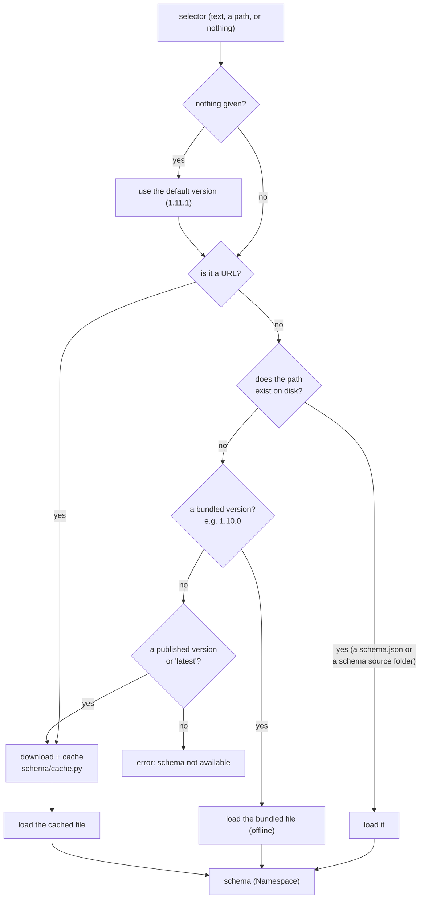

Notes:

- **One selector sets both version numbers.** A schema carries a BIDS version (for
  example `1.11.1`) and its own internal version (for example `1.2.1`). They are
  different counters that always travel together inside one schema, so bidsval never
  lets you set them apart. See [schema selection](schema-selection.md).
- **Bundled means offline.** Each bundled version is a self-contained schema file
  shipped inside the package, so the common case needs no network.
- **Both on-disk forms work.** The loader accepts a finished `schema.json` *and* a
  folder of schema source files (it expands the source folder on load), so a forked
  or in-development schema works the same way.
- **Caching.** Resolved schemas are remembered for the run, and downloaded schemas
  are saved under `~/.cache/bidsval/schemas/`. Downloads use certifi's certificate
  bundle when available so HTTPS works on macOS (where Python's default certificate
  handling often fails).

### Reading vocabulary: `introspect.py`

Once a schema is resolved, [`schema/introspect.py`](../src/bidsval/schema/introspect.py)
reads the BIDS vocabulary out of it. Results are *memoised* (computed once and
remembered, so repeated calls during a run are free):

| Function | Returns |
|---|---|
| `datatypes(schema)` | the datatype folder names (`anat`, `func`, `eeg`, ...) |
| `suffixes(schema)` | the valid suffix words (`T1w`, `bold`, ...) |
| `extensions(schema)` | known file extensions, **longest first** so `.nii.gz` wins over `.gz` |
| `short_to_long(schema)` | an entity's short name to its long name (`sub` to `subject`) |
| `entity_pattern(schema, long)` | the text pattern an entity's value must match |
| `modality_for(schema, datatype)` | the modality a datatype belongs to (`anat` to `mri`) |
| `metadata_by_name(schema)` | metadata field definitions grouped by field name (one name can have several definitions for different contexts) |
| `directory_recordings(schema)` | the extensions that are whole-folder recordings (`.ds`, `.mefd`, ...) |

This is the entire reason bidsval is version-independent: every BIDS term it knows
comes from here, never from fixed text in the code.

---

## 8. Layer 2: indexing the files

[`files/tree.py`](../src/bidsval/files/tree.py) builds a `FileTree`: a single scan of
the dataset folder into an index of files, each addressed by its path relative to
the dataset root. Contents are never read here; they are read on demand later.

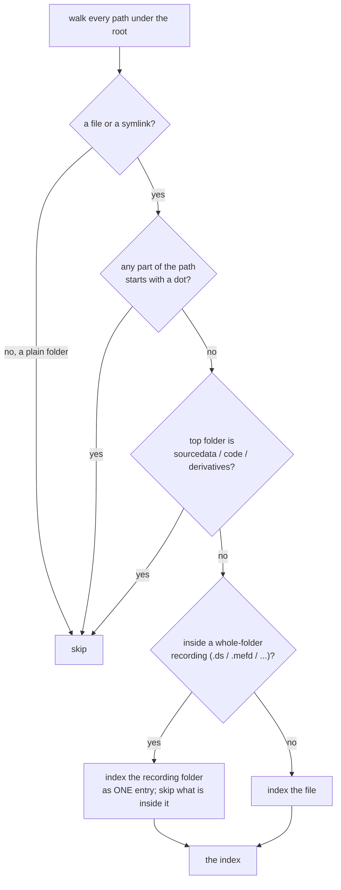

(A *symlink*, short for symbolic link, is a small file that points at another file.)
Each decision in the tree prevents a class of false alarm:

- **Symlinks are indexed as existing.** Datasets cloned from OpenNeuro often store
  large files as unfetched *git-annex* links (placeholders that stand in for a file
  that has not been downloaded). Indexing them keeps existence checks correct, while
  their content is never read.
- **Hidden paths are skipped** (anything starting with a dot, such as `.git` or
  `.DS_Store`): these are housekeeping, not dataset content.
- **`sourcedata` / `code` / `derivatives` are reserved** at the top level and not
  validated as part of the parent dataset (a derivative dataset is validated on its
  own).
- **Whole-folder recordings are single units.** Some recordings are folders, not
  files (CTF `.ds`, MEF `.mefd`, OME-Zarr, ...); the schema marks them with an
  extension ending in `/`. The tree indexes the folder as one entry and does not
  look inside it, so its internal files are never validated on their own.

The tree also offers the lookups the rest of the engine needs: every file; one file
by path; whether a path exists (from the index only, so a hidden file or a `..`
escape cannot accidentally match); the list of subjects; the direct children of a
folder; and a file's ancestor folders from its own folder up to the root (which
drives inheritance and associations, below).

---

## 9. Layer 3: building a per-file context

The **context** is the dictionary of facts the rules are evaluated against. Building
a correct context is most of the validator's work; the rules themselves are then a
mechanical step.

[`context/builder.py`](../src/bidsval/context/builder.py) computes the dataset-wide
facts once, then a per-file context on demand.

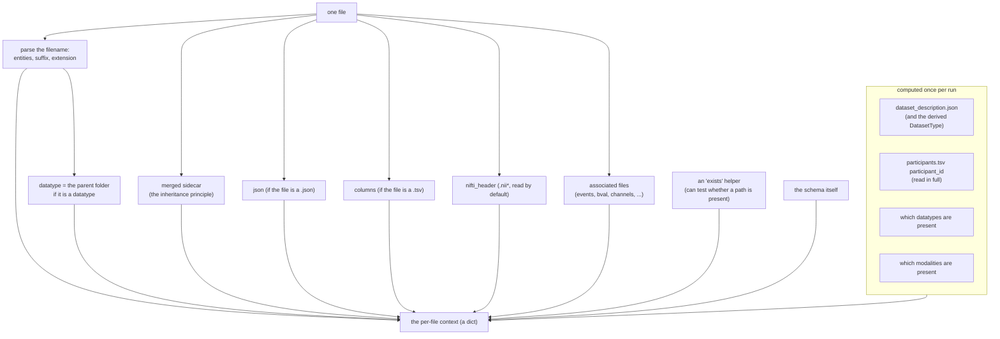

### The context keys

The keys follow the schema's own description of a context (`meta.context`):

| Key | Value |
|---|---|
| `path` | the file's path relative to the dataset, with a leading `/` |
| `size` | the file size in bytes |
| `entities` | the `{short_name: value}` pairs parsed from the filename (e.g. `{"sub": "01"}`) |
| `datatype` | the immediate parent folder if it is a BIDS datatype, else empty |
| `suffix` | the filename suffix (`T1w`, `bold`, ...) |
| `extension` | the file extension (the longest the schema knows, e.g. `.nii.gz`) |
| `modality` | the datatype's modality (`anat` to `mri`) |
| `sidecar` | the metadata that applies to this file, merged by the inheritance principle (below) |
| `json` | the parsed contents, if this file itself is a `.json`, else empty |
| `columns` | the table columns, if this file is a `.tsv`, else empty |
| `nifti_header` | the parsed NIfTI header, or nothing if not read |
| `associations` | the resolved associated files (below) |
| `subject` | a placeholder for future per-subject summaries |
| `dataset` | the shared dataset-wide facts |
| `schema` | the schema itself (some checks read from it) |
| `__exists_resolver__` | a helper the `exists()` function uses to test paths |

(A *sidecar* is a JSON file holding metadata for a data file, for example
`sub-01_T1w.json` sitting next to `sub-01_T1w.nii.gz`.)

### Entities: `context/entities.py`

`parse_filename` splits `sub-01_acq-hi_T1w.nii.gz` into entities
(`{"sub": "01", "acq": "hi"}`), a suffix (`T1w`), and an extension (`.nii.gz`).
Entities are keyed by their short name, matching the reference validator.

### Inheritance: `context/inheritance.py`

The BIDS *inheritance principle* says a metadata sidecar applies to a data file when
it sits in the same folder or a parent folder, its entities are a subset of the data
file's (with matching values), and its suffix matches. More specific sidecars (in a
deeper folder, or with more entities) override less specific ones. ("A subset" here
means every entity in the sidecar's name also appears, with the same value, in the
data file's name.)

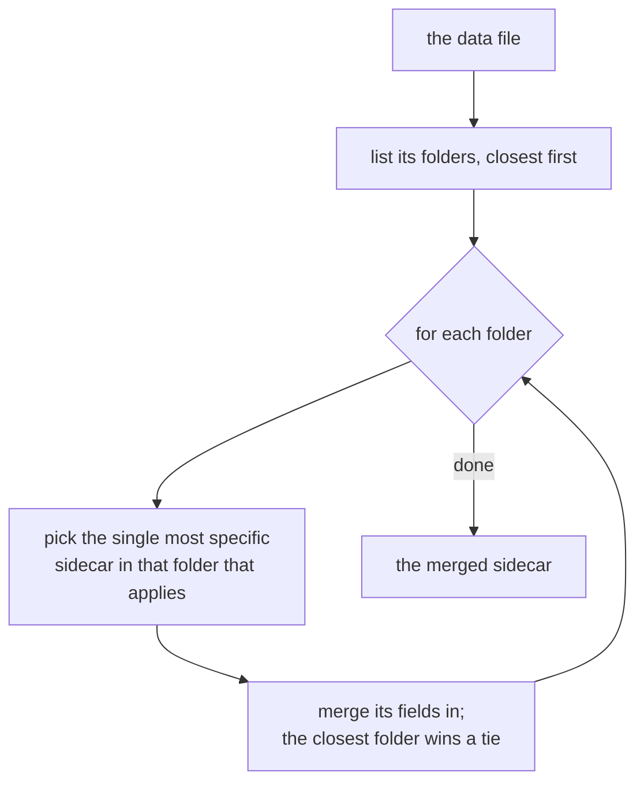

The one subtlety: **at most one sidecar per folder level** (the most specific match),
then merge across levels closest-first. Choosing one per level avoids pulling a field
from a less specific sidecar that the standard would not apply.

### Associations: `context/associations.py`

Many checks look at files that travel with a data file: a `dwi` file's `.bval` /
`.bvec` (the diffusion gradient tables), a task recording's `events.tsv`, an
electrophysiology recording's `channels.tsv`, an ASL run's `aslcontext.tsv`, and so
on. The schema describes each of these in `meta.associations` (a condition for when
it applies, what filename to look for, and whether it is inherited up the folders).
bidsval finds them with the same nearest-first walk as inheritance and exposes each
under `associations.<name>` with the fields the checks read (a table's columns plus
its row/column counts and its sidecar; a gradient table's values and shape; or just
the path for a plain "does it exist" check).

Built today: `events`, `bval`, `bvec`, `channels`, `aslcontext`, `m0scan`,
`magnitude`, `magnitude1`, `coordsystem`, `electrodes`, `physio`,
`atlas_description` (the atlas descriptor file), and `coordsystems` (the aggregate of
every `space-` coordsystem file, exposing `paths` / `spaces` /
`ParentCoordinateSystems` for the EMG coordinate-system rules). Only the gzip / ome /
tiff content headers remain unbuilt; the rule engine skips rules that reference those
(see [section 13](#13-the-no-false-positives-invariant)).

### Loading content: `context/loaders.py`

Every loader fails softly. A missing reader, an unreadable file, or a parse error
yields an empty result instead of an error, so a malformed dataset never crashes a
run; the rule that needed the content simply does not fire.

- `load_json` uses Python's standard library (always available).
- `load_columns` uses pandas. `participants.tsv` and `*_scans.tsv` are read in full
  (they feed "are these exactly the right rows" checks); other tables are read up to
  a row cap (default 1000) for speed.
- `load_nifti_header` uses nibabel; it runs by default (pass `--no-headers` to skip).

### The `exists` helper

The schema's `exists(paths, mode)` function needs to test whether referenced paths
are present in the dataset. The builder installs a small helper on the context that
resolves a referenced path relative to the dataset root, the subject, the `stimuli/`
folder, or the file's own folder (depending on the `mode`) and answers from the file
index. (This helper is a *closure*: a function that remembers the file and subject it
was created for.)

---

## 10. Layer 4: evaluating expressions

[`expr/evaluator.py`](../src/bidsval/expr/evaluator.py) evaluates one schema condition
against a context. Parsing (turning the condition text into structure) is reused from
`bidsschematools`, which returns a small tree of node types. bidsval walks that tree.
("Parsing" produces an *abstract syntax tree*, or AST: the tree-shaped form a parser
turns text into. "Walking the tree" means visiting each node to compute a result.)

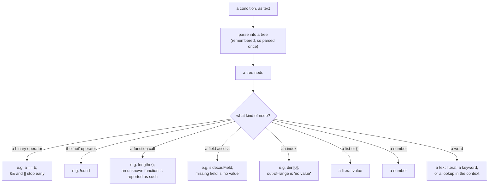

Two deliberate choices, and the meaning that follows:

- **No `eval`/`exec`.** The conditions come from the trusted schema, but bidsval
  still evaluates them by an explicit tree walk rather than by running them as Python
  code. That gives well-defined meaning, clear error messages, and keeps code
  execution off the table entirely. (Python's `eval`/`exec` would run arbitrary code;
  bidsval never uses them.)
- **Same answers as the reference.** The operators and the handling of "no value"
  match the reference validator's JavaScript code, and that match is locked in by
  running the schema's own built-in expression tests as a check.

The *value model* (in [`expr/functions.py`](../src/bidsval/expr/functions.py)) follows
JavaScript, not Python, in two spots that are easy to get wrong:

- **Truthiness** (whether a value counts as true in a yes/no test): an empty list
  `[]` and an empty object `{}` count as **true**; the empty text `""`, `0`, and "no
  value" count as false.
- **"No value" (null) spreads.** "No value" flowing into a field access, an index,
  arithmetic, or a comparison produces "no value" again; equality treats "no value"
  as equal only to "no value". A result of "no value" is the engine's signal for "I
  could not determine this", which it treats as a skip, never a failure.

The built-in functions (`type`, `intersects`, `match`, `substr`, `min`, `max`,
`length`, `unique`, `count`, `index`, `allequal`, `sorted`, `exists`) live in one
lookup table, so the supported set is explicit and easy to check against the schema.
A function the engine does not know (one a newer schema might add) is reported as
unknown and the rule using it is skipped, rather than crashing.

---

## 11. Layer 5: the rule engine

[`rules/engine.py`](../src/bidsval/rules/engine.py) is the interpreter. For one file's
context, `apply_rules` walks the schema's rule groups, evaluates each rule that
applies, then runs one final pass that checks the value of every present field, then
removes duplicates.

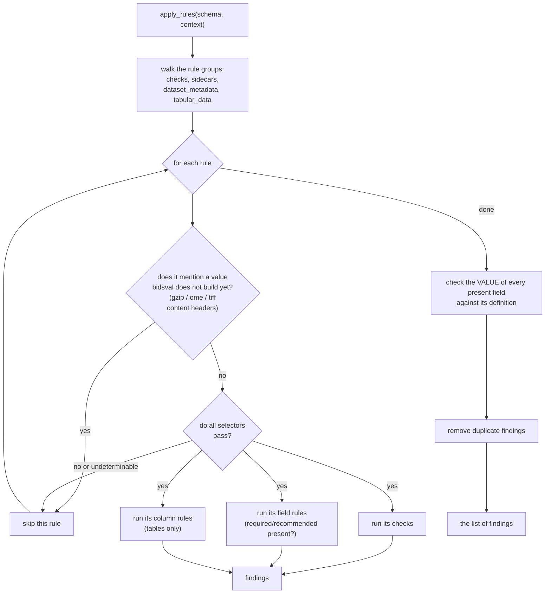

### Checks

A rule's *checks* are conditions, gated by its selectors. The decision for a single
check is where the no-false-positives rule lives:

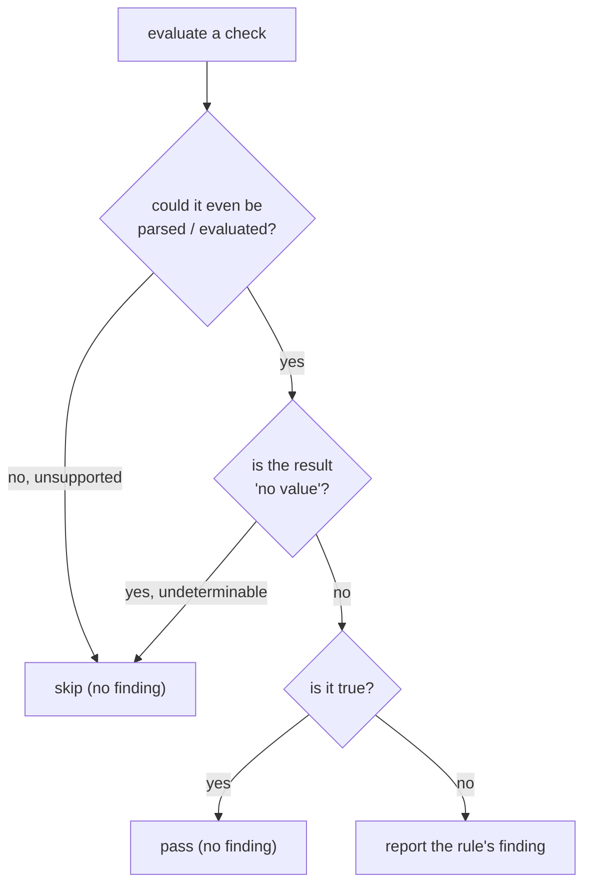

So a finding is raised **only** on a clear, non-empty false result. Anything that
could not be parsed, or that came back as "no value" because some needed content was
absent, is treated as "cannot determine" and skipped. The finding's code, message,
and level (error or warning) come from the schema rule itself; bidsval also attaches
*provenance* (the rule's path, selectors, and checks) so a tool can later explain
*why* something failed.

### Field rules (sidecar and dataset metadata)

`sidecars` and `dataset_metadata` rules list required and recommended fields per
datatype and suffix. For each field the engine resolves a **severity**:

| Schema requirement level | Severity | Effect |
|---|---|---|
| `required` | error | a missing field is an error |
| `recommended` | warning | a missing field is a warning |
| `optional` | ignore | not reported |
| `prohibited` | ignore | not reported here |

One refinement keeps this correct:

- **Conditional levels.** A note like "required if `X` is `Y`" is honoured: the
  level is raised only when the sidecar actually has `X` equal to `Y`.

These field rules are applied on derivative datasets too: the reference validator
reports the same required and recommended fields regardless of `DatasetType`, so
bidsval does not exempt derivatives (it used to, which under-reported recommended
fields on atlas and other derivative datasets).

Field rules check **presence only**. The *value* of every present field is checked
separately in one pass (below), so the set of fields bidsval reports matches the
reference exactly.

### Table columns: `rules/tables.py`

For a table that was read, `eval_columns` checks the actual columns against the
`tabular_data` rule:

- a required defined column that is missing -> `TSV_COLUMN_MISSING` (error);
- an extra column that is neither defined by the schema nor documented in the sidecar
  -> `TSV_ADDITIONAL_COLUMNS_UNDEFINED` (warning) or
  `TSV_ADDITIONAL_COLUMNS_NOT_ALLOWED` (error), depending on the rule;
- the initial columns out of order -> `TSV_COLUMN_ORDER_INCORRECT`; an index column's
  values not unique -> `TSV_INDEX_VALUE_NOT_UNIQUE`; the deprecated `89+` age ->
  `TSV_PSEUDO_AGE_DEPRECATED`;
- a value that does not match its column's type, format pattern, allowed values
  (enum), or numeric bounds -> `TSV_VALUE_INCORRECT_TYPE` (error), with the row number;
- a sidecar that redefines a schema column's type incompatibly ->
  `TSV_COLUMN_TYPE_REDEFINED` (warning).

Value checking uses the column's full *signature* (`rules/column_types.py`): the
schema's format pattern, enum levels, and bounds, optionally refined by the sidecar.
It mirrors the reference (including its loose multi-format pattern), so the checks
stay a subset of the reference's, never a false positive; free-text (string) columns
are skipped.

### Field-value validation: `rules/values.py`

After the rule walk, `_validate_present_values` checks the value of **every** present
field on each `.json` file (not only fields a rule names) against its definition in
the schema. It runs on the `.json` files only, not on a data file's merged sidecar:
that matches the reference validator's attribution and avoids reporting the same bad
value twice (once on the `.json`, once on the `.nii.gz`). A field name can have
several definitions for different contexts; the value is valid if it matches **any**
of them, so a name used in two places never causes a false alarm. The check
implements the part of the schema's type system the BIDS fields actually use: type,
allowed-value list, "any of these", item type, and numeric or length bounds. A
failure becomes a `JSON_SCHEMA_VALIDATION_ERROR` (error), such as
`Authors must be array`.

### Filename checks: `validate_basename`

Run alongside the rules, this checks that each *known* entity's value matches the
schema's pattern for that entity, reporting `ENTITY_VALUE_INVALID` on a mismatch. It
is conservative on purpose: unknown entity names are not flagged here (they may be
legitimate custom entities), and only entities the schema constrains are checked.

### Non-schema file checks: `rules/bespoke.py`

Two checks the schema does not express as rules, copied from the reference but
reported more helpfully (with an explanation and a machine-actionable repair hint):

- **`EMPTY_FILE`** (error): a 0-byte file exists but holds no data. Skipped on a
  symlink (an unfetched placeholder has no local content to judge).
- **`NIFTI_HEADER_UNREADABLE`** (error): when headers are read (the default), if the
  NIfTI header could not be read. The two checks do not gate each other, so an empty
  `.nii(.gz)` is reported as both `EMPTY_FILE` and `NIFTI_HEADER_UNREADABLE`, matching
  the reference validator.

---

## 12. Layer 6: results and rendering

### The typed result

Every problem bidsval reports is a pydantic [`Issue`](../src/bidsval/issues.py). Its
fields mirror the reference validator's (`code`, `severity`, `location`, `rule`, ...)
so output can be made interchangeable, plus three fields the reference does not offer:

- `suggestion` - a plain-language, **actionable** note: what the missing or wrong
  file, field, or column should contain, with a concrete example synthesised from the
  schema (e.g. ``RepetitionTime ... Add it to the JSON, for example
  {"RepetitionTime": 1.0}.``). Every renderer shows it as a "how to fix" line, so a
  finding tells the user not just what is wrong but how to fix it. Built in
  [`rules/guidance.py`](../src/bidsval/rules/guidance.py).
- `provenance` - the schema rule that produced the finding, so a tool can explain
  *why* it fired;
- `fix` - a machine-actionable repair hint (an action token + field), so a tool or
  GUI can offer a one-click fix. (bidsval never applies fixes itself.)

Findings combine into a [`ValidationReport`](../src/bidsval/report.py):

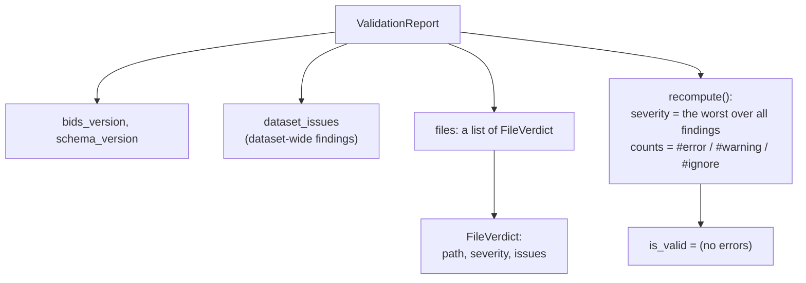

Severities are ordered ignore < warning < error. `recompute()` counts every finding
once (dataset-wide and per file) and sets the overall result; `is_valid` is simply
"no errors". `filtered(severities)` returns a copy keeping only chosen severities,
which is what `--show` uses; it never changes validity. (Combining many findings into
one overall severity is the *rollup*.)

### Rendering

[`render/`](../src/bidsval/render/__init__.py) holds four functions, one per output
format, listed in a single table the CLI reads:

| Format | Shape |
|---|---|
| `text` | a readable summary: a header, one line per finding (`SEVERITY CODE [field] file - message`) with a "how to fix" line under it, the counts, and `VALID`/`INVALID` |
| `json` | a flat, stable object: run details, counts, and one list of findings |
| `sarif` | SARIF 2.1.0, a standard JSON format that code-scanning tools (GitHub, GitLab, IDE problem panels) read |
| `html` | a self-contained, styled report you open in a browser |

Each renderer is a plain function of the report, so the same report can go to the
screen or to any number of files (`--out-dir`).

---

## 13. The no-false-positives invariant

bidsval's defining property: **it never reports a false positive** (an error the
reference validator does not). The guarantee is built into several points, not bolted
on as a final filter. (A *false positive* is a problem that is reported but is not
actually a problem.)

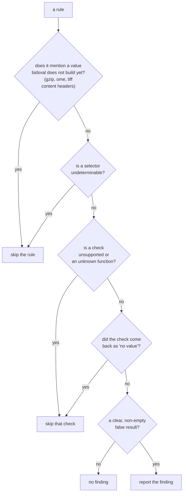

Where each guard sits:

- **Values not built yet:** a rule that mentions a value bidsval does not compute yet
  (the gzip / ome / tiff content headers) is skipped whole, so it is never tested
  against empty data.
- **Undeterminable conditions:** a condition that cannot be parsed, or that uses a
  function from a newer schema, skips the rule or check rather than failing.
- **"No value" means "cannot determine":** a check that comes back as "no value"
  (some needed content was absent) is treated as a pass, never a finding.
- **Conservative layers:** filename checks only test entities the schema constrains;
  table validation skips allowed-value checks; field-value validation accepts a value
  that matches any definition of its name.

The trade-off is deliberate: bidsval would rather *miss* a finding it cannot prove
than invent one. This is verified by comparing bidsval against the reference
validator across the official `bids-examples`, converted datasets, and OpenNeuro
metadata-only clones: zero false positives. (The one code bidsval reports that the
reference does not is a PET-conditional required field, where bidsval is being *more*
faithful to the schema, because it fills in which modalities are present and the
reference leaves that empty.)

---

## 14. Performance and safe degradation

Two engineering properties run through every layer: bidsval is fast because it does
work once and only when needed, and it is robust because it never lets missing or
malformed input crash a run.

### Doing work once: caching and indexing

The rule engine evaluates hundreds of conditions against every file, so repeated work
is remembered at each level rather than redone per file. (*Caching* / *memoising*
means remembering a result so the same work is not repeated.)

| Cached / indexed | Where | Effect |
|---|---|---|
| the resolved schema | `schema/resolve` | the same selector loads one schema object, reused for the whole run |
| the vocabulary | `schema/introspect` | datatypes, entities, suffixes, ... are computed once per schema |
| each parsed condition | `expr/evaluator` | each distinct condition text is parsed once, not once per file |
| the dataset-wide facts | `context/builder` | subjects, `dataset_description`, the datatypes/modalities present are computed once |
| files grouped by folder | `files/tree` | inheritance and association walks find a folder's children instantly (a constant-time lookup) |

### Doing work only when needed

The file index records paths only; **content is never read until a rule needs it**
(this is *laziness*). JSON is parsed on demand, table columns and NIfTI headers only
when a file of that kind is validated (headers are read by default). Big tables
are bounded: most are read up to a row cap (default 1000), while `participants.tsv`
and `*_scans.tsv` are read in full because they feed "are these exactly the right
rows" checks.

### Safe degradation: missing or malformed input never crashes

Every input path has a defined "cannot determine" outcome, and that outcome is always
*skip*, never *crash* and never *false alarm*.

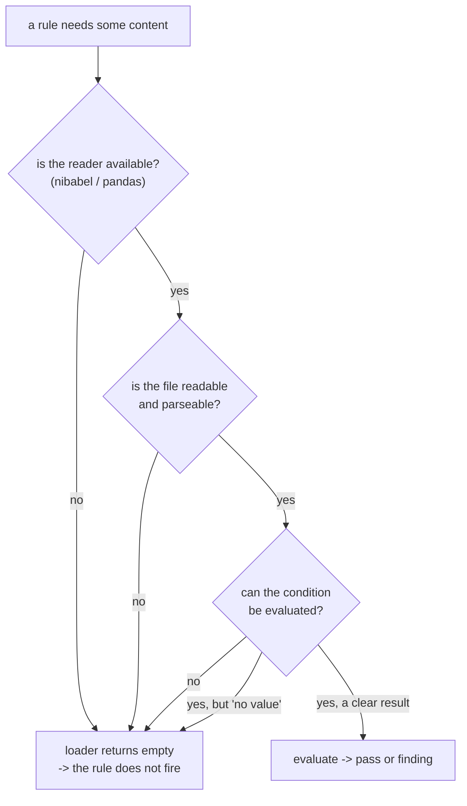

The guarantees behind that diagram:

- **Loaders fail soft.** `load_json` / `load_columns` / `load_nifti_header` return
  an empty result on a missing reader, an unreadable file, or a parse error.
- **The evaluator fails soft.** A wrong number of arguments or an unexpected type
  returns "no value"; arithmetic on non-numbers or a divide-by-zero returns "no
  value"; an unknown function (a newer schema) is reported as unknown and the rule is
  skipped.
- **The control code fails soft.** Each file is validated inside a `try`/`except`;
  any unexpected error becomes one `bidsval.internal_error` warning on that file and
  the run continues.

The net effect is that a partly-downloaded, slightly broken, or unusual dataset still
validates as far as it can, reporting only what it can prove. That is the same
discipline that produces the
[no-false-positives invariant](#13-the-no-false-positives-invariant).

---

## 15. Version independence and extension points

Because behaviour is read from the schema, supporting a new BIDS release usually
means **adding a bundled schema file**, not changing code. New datatypes, entities,
suffixes, fields, and rules flow in automatically.

Code changes are only needed to teach the engine a genuinely new *ability*:

- a new built-in **function** the schema starts using -> add it to the lookup table
  in `expr/functions.py`;
- a new **association** or combined value the schema relies on -> build it in
  `context/` and remove its name from the skip-list in `engine.py` (only once it is
  genuinely built);
- a new **content reader** (a header format, a table shape) -> add a loader in
  `context/loaders.py`;
- a new **output format** -> add a renderer and register it in `render/`.

Whenever a new check is added, the discipline is the same: re-run the comparison
against the reference validator and confirm the false-positive count stays at zero.

---

## 16. Issue-code catalogue

Every code bidsval can report, where it comes from, and its severity.

| Code | Severity | Source | Meaning |
|---|---|---|---|
| `MISSING_DATASET_DESCRIPTION` | error | `validate.py` | `dataset_description.json` is missing at the root |
| `NO_SUBJECTS` | warning | `validate.py` | no `sub-*` folders were found |
| `FILE_NOT_FOUND` | error | `validate.py` | a file passed to `validate_file` is not under the root |
| `bidsval.internal_error` | warning | `validate.py` | an unexpected error while validating one file (the run continues) |
| `EMPTY_FILE` | error | `rules/bespoke.py` | a 0-byte file |
| `NIFTI_HEADER_UNREADABLE` | error | `rules/bespoke.py` | the NIfTI header could not be read (headers are read by default; `--no-headers` to skip) |
| `CASE_COLLISION` | error | `rules/dataset_checks.py` | two files differ only by letter case |
| `SIDECAR_WITHOUT_DATAFILE` | error | `rules/dataset_checks.py` | a JSON sidecar applies to no data file |
| `MULTIPLE_INHERITABLE_FILES` | error | `context/inheritance.py` | a directory has more than one applicable sidecar, none exact |
| `SIDECAR_FIELD_OVERRIDE` | warning | `context/inheritance.py` | a less specific sidecar's field is overridden by a more specific one |
| `UNUSED_STIMULUS` | warning | `rules/dataset_checks.py` | a file in `stimuli/` is referenced by no events.tsv |
| `CITATION_CFF_VALIDATION_ERROR` | error | `rules/citation.py` | `CITATION.cff` is not valid YAML or is missing required keys |
| `TSV_ADDITIONAL_COLUMNS_MUST_DEFINE` | error | `rules/tables.py` | an extra column is not documented in the sidecar (where the rule requires it) |
| `TSV_PSEUDO_AGE_DEPRECATED` | warning | `rules/tables.py` | the deprecated `89+` value in an `age` column |
| `TSV_INDEX_VALUE_NOT_UNIQUE` | error | `rules/tables.py` | an index column's values are not unique |
| `TSV_COLUMN_ORDER_INCORRECT` | error | `rules/tables.py` | the schema's initial columns are not first, in order |
| `INVALID_GZIP` | error | `rules/integrity.py` | a `.tsv.gz` gzip stream could not be decompressed |
| `JSON_INVALID` | error | `rules/integrity.py` | a `.json` file is not valid JSON |
| `JSON_NOT_AN_OBJECT` | error | `rules/integrity.py` | a `.json` file does not contain a single object |
| `INVALID_FILE_ENCODING` | error | `rules/integrity.py` | a `.json` file is not valid UTF-8 text |
| `FILE_READ` | error | `rules/integrity.py` | a `.json` file could not be read |
| `TSV_COLUMN_HEADER_DUPLICATE` | error | `rules/integrity.py` | two TSV columns share a header name |
| `TSV_EMPTY_LINE` | error | `rules/integrity.py` | a TSV has a blank line |
| `TSV_EQUAL_ROWS` | error | `rules/integrity.py` | a TSV row has a different number of values than the header |
| `NOT_INCLUDED` | error | `rules/filenames.py` | the file matches no BIDS naming rule (and is not in `.bidsignore`) |
| `INVALID_ENTITY_LABEL` | error | `rules/filenames.py` | an entity's label breaks the schema's value pattern |
| `ENTITY_WITH_NO_LABEL` | error | `rules/filenames.py` | an entity is present with no label (e.g. `acq-`) |
| `MISSING_REQUIRED_ENTITY` | error | `rules/filenames.py` | a required entity for this file type is absent |
| `ENTITY_NOT_IN_RULE` | error | `rules/filenames.py` | an entity not allowed for this file type is present |
| `DATATYPE_MISMATCH` | error | `rules/filenames.py` | the file is in the wrong datatype folder for its suffix |
| `EXTENSION_MISMATCH` | error | `rules/filenames.py` | the extension is not allowed for this file type |
| `INVALID_LOCATION` | error | `rules/filenames.py` | a valid name in the wrong place (sub-/ses- folders mismatch) |
| `FILENAME_MISMATCH` | error | `rules/filenames.py` | entities are duplicated or out of canonical order |
| `ALL_FILENAME_RULES_HAVE_ISSUES` | error | `rules/filenames.py` | several rules matched, each with a problem |
| `SIDECAR_KEY_REQUIRED` | error | `rules/engine.py` | a required sidecar field is missing |
| `SIDECAR_KEY_RECOMMENDED` | warning | `rules/engine.py` | a recommended sidecar field is missing |
| `JSON_KEY_REQUIRED` | error | `rules/engine.py` | a required `dataset_description` field is missing |
| `JSON_KEY_RECOMMENDED` | warning | `rules/engine.py` | a recommended `dataset_description` field is missing |
| `JSON_SCHEMA_VALIDATION_ERROR` | error | `rules/values.py` | a present field's value has the wrong type or value |
| `TSV_COLUMN_MISSING` | error | `rules/tables.py` | a required column is missing |
| `TSV_ADDITIONAL_COLUMNS_UNDEFINED` | warning | `rules/tables.py` | an extra column is undocumented |
| `TSV_ADDITIONAL_COLUMNS_NOT_ALLOWED` | error | `rules/tables.py` | an extra column where none are allowed |
| `TSV_VALUE_INCORRECT_TYPE` | error | `rules/tables.py` | a value breaks its column's type, pattern, allowed values, or bounds |
| `TSV_COLUMN_TYPE_REDEFINED` | warning | `rules/tables.py` | a sidecar redefines a schema column's type incompatibly |
| *(schema-provided)* | error/warning | `rules/engine.py` | a `checks` failure carries its own code from the schema (`CHECK_ERROR` if the rule names none) |

The `SIDECAR_KEY_*` / `JSON_KEY_*` codes can also be overridden by a code the schema
rule specifies; the table lists the defaults bidsval falls back to.

---

## 17. Glossary

Plain definitions of the technical terms used in this document.

| Term | Meaning |
|---|---|
| **abstract syntax tree (AST)** | the tree-shaped form a parser turns text into, so a program can work with the structure instead of raw text |
| **aggregate / combined value** | a value computed by combining several files (bidsval skips rules needing ones it does not build yet) |
| **association / associated file** | a file that travels with a data file (events, gradient tables, channels, ...) and that some rules look at |
| **BIDS** | Brain Imaging Data Structure: a standard for naming and organising neuroimaging data |
| **cache / memoise** | remember a result so the same work is not repeated |
| **check** | a condition in the schema that must hold once a rule applies |
| **closure** | a function that remembers values from where it was created |
| **coerce** | convert a value from one type to another (e.g. the text `"3"` to the number `3`) |
| **context** | the dictionary of facts about one file that the rules are evaluated against |
| **datatype** | the folder that groups a kind of data: `anat`, `func`, `eeg`, ... |
| **dereferenced schema** | a schema file with every internal cross-reference expanded inline, so it stands alone |
| **entity** | a `key-label` pair in a BIDS filename, such as `sub-01` or `task-rest` |
| **eval / exec** | Python features that run text as code; bidsval never uses them |
| **extension** | the end of a filename, such as `.nii.gz` or `.tsv` |
| **false positive** | a problem that is reported but is not actually a problem |
| **git-annex symlink** | a placeholder link standing in for a large file that has not been downloaded |
| **lazy** | doing work only when it is actually needed |
| **literal** | a fixed value written directly in the code (such as the text `"anat"`) |
| **modality** | the broad family a datatype belongs to: `anat` belongs to `mri` |
| **Namespace** | the in-memory object `bidsschematools` loads a schema into; read like a nested dictionary |
| **null / "no value"** | the absence of a value; in bidsval it signals "could not determine", which is treated as a skip |
| **parser / parse** | the code that reads text (a condition) and turns it into a structured form |
| **provenance** | the record of which schema rule produced a finding, used to explain why |
| **pydantic model** | a typed data class that checks its own fields and converts to and from JSON |
| **rollup** | combining many findings into one overall severity |
| **SARIF** | a standard JSON format that code-scanning tools (GitHub, IDEs) read |
| **selector** | a condition in the schema that decides when a rule applies |
| **serialisation** | turning an in-memory object into text such as JSON |
| **short-circuit** | `&&` stops at the first false; `\|\|` stops at the first true |
| **sidecar** | a JSON file holding metadata for a data file (e.g. `sub-01_T1w.json` next to `sub-01_T1w.nii.gz`) |
| **suffix** | the last label in a BIDS filename before the extension, such as `T1w` or `bold` |
| **symlink** | a small file that points at another file |
| **truthiness** | whether a value counts as true or false in a yes/no test |
| **vocabulary** | the set of BIDS terms (datatypes, entities, suffixes, ...) read from the schema |
